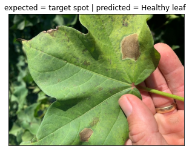

# Classifying Leaf Diseases of Cotton Plants
### Flatiron Capstone
### Ian Haas

### Project Overview
Identify common diseases that manifest on the leaves of cotton plants by comparing images of infected plants with images of diagnosed plants to efficiently identify diseases and lead to faster application of correct treatment.

### Data
Leaf images data set: Easily classifiable, visually identifiable; leaves are more photogenic  
Cotton Plant: Valuable commodity and large component of agriculture industry  
Sample Data: /Cotton Plant Disease. Randomly selected example of each class from data set  

Transfer learning with Keras and Tensor flow  
MobileNetV2 
Feature Extraction and Fine Tuning 

Random Transformation for training 
Loss: Cross Entropy , Accuracy 
Optimization: Adam Optimizer RMS Propagation 

### Results
Additional training data and tunining is needed to improve accurate output. 
Plant diseases that have a similar appearance may still be mistaken for each other. 

### For the Future
Optimization: Improve model with more data 
Specialization: Tailor to individual farming operations and specific species and crops  
Versatility: Identification on individual basis, possibly with mobile devices in the field, as well as systemic identification through tools like drone photography
